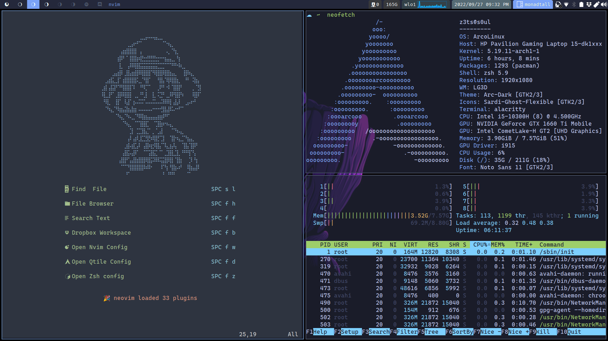

# Mis Dotfiles

# Indice
- [Resumen](#resumen)
- [Arch](#arch)
  - [Instalacion De ArcoLinux](#instalacion-de-arcolinux)
- [Qtile](#qtile)
  - [Config.py](#config)
  - [Scripts](#scripts)
    - [Autostart](#autostart)
    - [picom](#picom)
  - [Settings](#settings)
    - [Groups](#groups)
    - [Keys](#keys)
    - [Layouts](#layouts)
    - [Mouse](#mouse)
    - [Widgets](#widgets)
- [Neovim](#neovim)
  - [Init.lua](#init)
  - [Lua](#lua)
    - [Configuration](#configuration)
      - [Keymap](#keymap)
      - [Settings](#settings-nvim)
    - [Lua-Plugins](#lua-plugins)
      - [Plugins.lua](#plugins-lua)
    - [Plugins-Config](#plugins-config)
      - [LSP](#lsp)
        - [Init.lua](#lsp-init-lua)
      - [Plugins](#plugins)
    - [Themes](#themes)
- [Alacritty](#alacritty)
